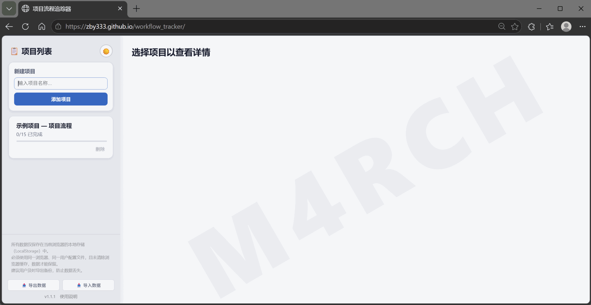
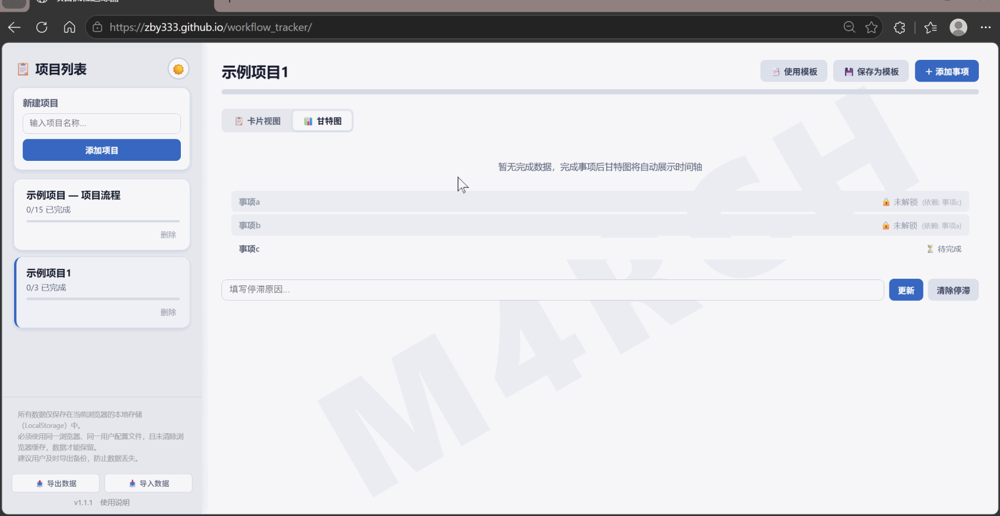
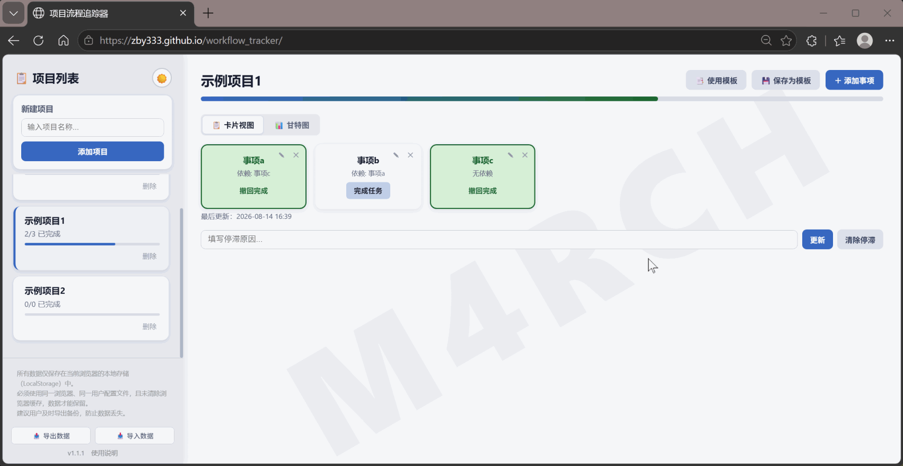

# SoloFlow — 个人本地流程追踪工具

**版本：v1.2.0**

SoloFlow 是一款专为个人设计的轻量本地工作流工具，旨在帮助用户理清复杂事项的执行顺序，降低流程性事务带来的认知负担。无论是工作计划、学习进度、备考安排还是旅行准备，都可以用它来建立清晰的事项依赖关系，让每一步有序推进。

工具以事项间的依赖关系为主线，当前阶段可执行的事项自动高亮，未满足前置条件的事项保持锁定，待条件满足后逐步解锁。无需构建复杂的标签体系或任务层级，通过项目状态（未开始 / 进行中 / 已完成 / 停滞）与甘特图时间线即可直观掌握整体进度。

典型应用场景包括：新员工入职时，通过预设模板快速熟悉多套并行流程，避免因业务不熟而遗漏关键节点；将高频流程沉淀为可复用的工作流模板；通过停滞原因标记与甘特图，随时了解各事项的当前状态与阻塞原因，便于汇报节点。

**所有数据仅在浏览器本地处理和存储，不会上传到任何服务器，也不会用于任何其他用途；无需注册账号、无需登录，打开页面即可使用。**

[](https://zby333.github.io/soloflow/) [](https://github.com/zby333/soloflow/archive/refs/tags/v1.2.0.zip)

## 💡 它解决什么问题

你手上同时有好几个项目在推进，每个项目都有好几步要走。你知道“今天要做这件事”，但不一定记得“这件事做完之后，下一步该做什么”？

这就是 SoloFlow 要解决的核心问题。

Todo List 只告诉你“有哪些事要做”，而 SoloFlow 告诉你“**先做什么、后做什么**”——你不需要自己记住每一步的顺序，工具会帮你理清。

你可以为每个事项设置「前置事项」：
- 前置未完成时，后续事项自动锁定，你只看得到“当前该做什么”
- 前置完成后，后续事项自动解锁，流程自然向前推进
- 配合甘特图，直观看到每个事项的实际完成时间与整体进度
- 多个项目同时推进时，每个项目的进度一目了然，停滞原因也能随时记录

## ✨ 核心功能

- **前置事项 / 自动解锁** — 为事项设置前置依赖，前置未完成时事项保持锁定（灰色）、完成后自动解锁（彩色）；支持随时调整依赖关系，内置循环依赖校验
- **甘特图 / 时间安排** — 基于实际完成时间戳绘制时间轴，已完成事项显示时间条，未完成事项显示状态标记（🔒/○），支持横向滚动
- **多场景内置模板** — 内置「通用工作项目」（OA / CRM / 工单系统等多平台待办统一监控，外部条件未满足的事项保持锁定等待）、「技能学习」（从确定目标到发布成果的完整进阶路径）、「旅游计划」（签证、机票酒店、行程、打包、出发确认等行前事项）三套模板；首次打开自动创建三个示例项目（分别展示未开始、部分完成、停滞三种状态），可自由删除
- **自定义模板** — 支持将任意项目保存为自定义模板，沉淀自己的流程经验，在新项目中一键复用
- **项目管理与停滞标记** — 新建、删除、切换多个项目；可为项目标注停滞原因，侧边栏红色边框高亮提醒
- **完成时间追踪** — 自动记录每个事项的完成时间，显示"最后更新"时间戳
- **数据持久化与备份** — 所有数据保存在浏览器 `localStorage` 中，支持导出为 JSON 备份文件并可导入恢复
- **6 种主题** — 浅色 / 蓝色 / 绿色 / 粉色 / 黄色 / 暗色，一键切换
- **侧边栏宽度可调** — 拖拽侧边栏右边缘自由调整宽度（200px ~ 500px），调整后自动记忆

## 🙋 SoloFlow 适合的场景

- 刚入职，业务不熟，流程不清，需要有人告诉你“下一步该做什么”
- 正在准备考试或学习新技能，内容多、顺序乱，不知道从哪开始
- 正在做个人项目（写作、视频、副业），想法多但不知道先推进哪个
- 同时处理多个生活或工作事项，几件事混在一起，看不清整体进度
- 对日渐复杂的项目管理软件感到疲惫，只想打开即用、轻量顺手

## 🔒 隐私与本地数据

SoloFlow 所有数据（项目、事项、模板、主题设置等）全程仅在当前浏览器的 `localStorage` 中处理和存储，**不会上传至任何服务器，也不会被用于任何其他用途** —— 应用不包含任何数据采集、统计分析或广告追踪代码。

使用本地存储请注意以下几点：

1. **必须使用同一浏览器** — 数据与浏览器绑定，切换浏览器后数据不会同步
2. **必须使用同一用户配置文件** — 同一浏览器的不同用户配置文件之间数据互不相通
3. **清除浏览器缓存将导致数据丢失** — 请勿手动清除浏览器缓存或 localStorage 数据
4. **请及时备份数据** — 使用页面底部的「📤 导出数据」按钮将数据保存为 JSON 备份文件
5. **数据恢复** — 使用「📥 导入数据」按钮从备份文件恢复数据，导入时将覆盖当前所有数据

## 📸 功能演示

### 快速上手 — 创建项目与依赖关系

创建项目、添加事项，并通过两种方式（创建时关联 / 事后编辑）建立依赖关系。



### 甘特图视图 — 进度追踪

通过甘特图直观查看事项完成时间及项目整体进度。



### 模板管理 — 保存与使用

将当前项目保存为自定义模板，并在新项目中快速复用。



## 🚀 使用方法

### 本地打开

直接在浏览器中打开 `index.html` 即可使用：

```bash
# macOS
open index.html

# Windows
start index.html

# Linux
xdg-open index.html
```

### 通过静态服务器

```bash
# Python
python -m http.server 8080

# Node.js (npx)
npx serve .
```

然后访问 `http://localhost:8080`。

## 💬 反馈与支持

使用中遇到问题，或有任何新想法，欢迎到 GitHub Issues 提交反馈：

- 🐛 **Bug 报告** — 功能不正常、页面出错等问题：[提交 Bug 报告](https://github.com/zby333/soloflow/issues/new?template=bug_report.md)
- ✨ **功能请求** — 建议新功能或改进：[提交功能请求](https://github.com/zby333/soloflow/issues/new?template=feature_request.md)

不确定选哪种？也可以直接从 [统一入口](https://github.com/zby333/soloflow/issues/new/choose) 开始。

## 📁 项目结构

```
soloflow/
├── index.html          # 主页面
├── css/
│   └── style.css       # 样式文件（含 6 套主题配色）
├── js/
│   └── app.js          # 应用逻辑
├── assets/
│   ├── demo_quickstart.gif   # 演示：快速上手
│   ├── demo_gantt.gif        # 演示：甘特图视图
│   └── demo_template.gif     # 演示：模板管理
├── .github/
│   └── ISSUE_TEMPLATE/ # GitHub Issues 反馈模板
├── README.md           # 项目说明
└── LICENSE             # MIT 许可证
```

## 🛠 技术栈

- **HTML5** — 语义化结构
- **CSS3** — CSS Variables 主题系统、Flexbox 布局、CSS 动画
- **Vanilla JavaScript** — 无框架依赖，零构建
- **localStorage** — 浏览器端数据持久化

## 📝 更新日志

### v1.2.0 (2026-08-15)

**功能更新**
- ✨ 新增事项依赖编辑功能，支持随时调整前置依赖，并内置循环依赖校验，防止 A→B→A 死循环导致流程卡死
- 📑 内置模板重建为「通用工作项目」（OA / CRM / 工单系统等多系统待办监控）、「技能学习」、「旅游计划」三套，命名统一简化
- 🚀 首次打开自动创建三个示例项目，分别展示未开始、部分完成（含甘特图时间跨度）、停滞三种状态，可自由删除
- 💬 新增反馈渠道：README「反馈与支持」板块、页面反馈链接与 GitHub Issue 模板
- 📸 新增功能演示动图（快速上手 / 甘特图 / 模板管理）

**体验优化**
- 📊 甘特图支持横向滚动，未完成事项显示状态标记（🔒/○）
- 🛡 新增 HTML 字符转义防护与 localStorage 解析容错，数据损坏不再导致页面崩溃
- 📝 README 围绕「个人本地流程追踪工具」定位重写，项目正式更名为 **SoloFlow**

**问题修复**
- 🐛 修复甘特图时间条与日期文字重叠遮挡问题
- 🐛 修复未完成任何事项时甘特图错误显示蓝色时间条的问题
- 🐛 修复事项较多时甘特图时间条过窄、日期显示不全的问题

### v1.1.0 (2026-08-14) - 首个公开版本

**新增功能**
- ✨ 数据导入/导出备份功能（支持 JSON 格式备份与恢复）
- ✨ 侧边栏宽度拖拽调整（200px ~ 500px，自动记忆）
- ⚠️ 本地数据存储风险提示
- 🔗 「使用说明」链接（跳转 GitHub README）

**核心功能**
- 项目管理、事项依赖、完成状态追踪
- 甘特图 / 卡片视图切换
- 自定义模板与内置模板
- 6 种主题配色
- 停滞原因标记
- 数据本地持久化（localStorage）

## 📜 版权与许可

- **代码**：基于 [MIT License](./LICENSE) 开源
- **字体**：使用系统内置字体（Segoe UI / Microsoft YaHei），无需加载外部字体文件
- **图标**：仅使用 Unicode Emoji，无第三方图标库
- **框架**：无第三方 CSS 框架或 JS 库依赖
